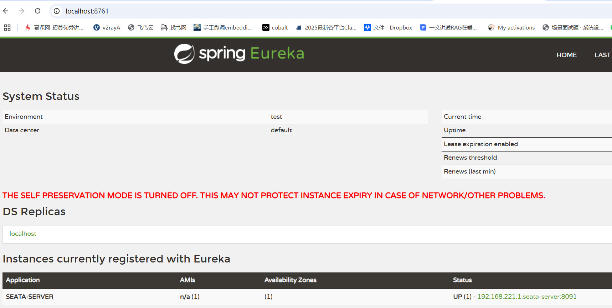

# 2.5.0
## 基于官方2.5版本修改，主要改动点如下
1. server目录，也就是seata-server子项目

* 支持选择注册到eureka还是nacos（根据yaml文件），注意如果是eureka则要先启动eureka
eureka配置如下
```yaml
seata:
  config:
    type: file
  registry:
    type: eureka
    eureka:
      service-url: http://localhost:8761/eureka/
      application: seata-server
      weight: 1
  store:
    mode: file
```
注册成功，进入eureka的dashboard
进入eureka的 *[dashboard](http://localhost:8761/)*.
可以看到对应的服务名
